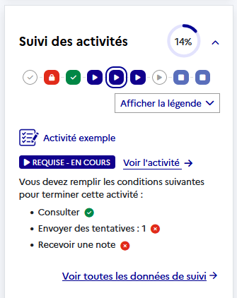
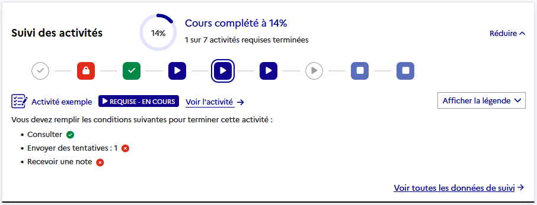

# Introduction

Cette documentation décrit la réutilisation et l’intégration du plugin "completion_monitor". Ce plugin est de type "block".

Un bloc Moodle est un composant modulaire permettant d’afficher des informations ou fonctionnalités supplémentaires.

# Objectif

L’objectif principal du plugin est d’afficher au sein d’un cours, un bloc permettant de visualiser son avancement sur une sélection d’activités, en intégrant :

- Le taux de complétion du cours
- La liste des activités du cours
    - Les activités requises pour terminer le cours
    - Les activités optionnelles
- Le détail de complétion des activités
    - Le statut de complétion de l'activité
    - Un lien vers la page de l'activité
    - La/Les condition(s) d'achèvement de l'activité

# Prérequis
Pour l'installation et la configuration du plugin :
- Moodle version >= 4.5.*
- Un accès administrateur

# Utilisation et configuration du bloc
## Conditions d'affichage du bloc dans le cours
Le bloc `completion_monitor` s'ajoute automatiquement dans un cours quand ces deux conditions sont remplies :
- Au moins une activité dans le cours contient une condition d'achèvement active
- Le cours qui contient au moins une activité avec une condition d'achèvement, à une condition d'achèvement de cours active

## Position latérale
### Introduction
Après l’installation du plugin, celui-ci sera affiché par défaut dans la barre latérale du cours s’il répond aux conditions d’affichage.



Il n'est pas possible d'ajouter le bloc manuellement.

## Position centrale
### Introduction
Vous avez aussi la possibilité d'afficher le bloc completion_monitoring en haut de la page du cours.



Pour ce faire, il faut ajouter de la configuration dans le code de votre application Moodle. Après cela, le bloc s'affichera par défaut en haut de la page du cours, au lieu de s'afficher dans la barre latérale.

> [!TIP]
> Les étapes qui suivent sont spécifiques au positionnement du bloc en haut d'une page de cours. Elles sont totalement optionnelles si vous ne voulez pas changer de position le bloc, et ne sont pas nécessaires pour son fonctionnement de base.

> [!WARNING]
> Si vous souhaitez afficher le bloc en haut d'une page de cours, nous vous conseillons de réaliser les étapes qui suivent avant d'installer le plugin.

### Configuration
#### config.php
Dans votre fichier `config.php`, ajouter le code suivant :
```php
// Définition de la position du block_completion_monitor dans le cours
$CFG->blocktopregion = "top-block";
```

#### Votre thème
Pour la suite de la configuration, vous avez besoin d'accéder aux fichiers du thème que vous utilisez.

> [!NOTE]
> La chaîne de caractère `mon_theme/` désignera le répertoire du thème que vous utilisez pour votre plateforme Moodle.

##### lib.php
Dans le fichier `mon_theme/lib.php`, en haut de celui-ci, à la suite de la définition de la constante `MOODLE_INTERNAL` (si elle existe dans votre fichier), ajouter la définition de la constante `BLOCK_POS_TOP`:
```php
/**#@+
 * Default name for the block top region.
 */
define('BLOCK_POS_TOP',  'top-block');
```

##### config.php
Dans le fichier `mon_theme/config.php`, il faut ajouter une configuration qui va définir une nouvelle région dans les templates relatifs à un cours.

Ajouter **ou** compléter les tableaux contenant des éléments de configuration avec le code suivant:

```php
$THEME->regions = [
    ...,
    'top-block',
];

$THEME->layouts = [
    ...,
    'course' => array(
        'file' => 'drawers.php',
        'regions' => array('side-pre', 'top-block'),
        'defaultregion' => 'side-pre',
        'options' => array('langmenu' => true),
    ),
]

// ou 

$THEME->layouts = [
    ...,
    'course' => [
        'file' => 'drawers.php',
        'regions' => ['side-pre', 'top-block'],
        'defaultregion' => 'side-pre',
        'options' => ['langmenu' => true],
    ],
]
```

##### drawers.php
Dans le fichier `mon_theme/layout/drawers.php`, il y a deux étapes à suivre :

1. Il faut ajouter un bloc de code qui vérifie si la région `top-block` existe dans le cours où se trouve l'utilisateur. Si c'est le cas, le code HTML du bloc `completion_monitor` sera généré et stocké dans la variable `$cmblockhtml`.

Ajouter le bloc de code avant la variable `$templatecontext`:

```php
$cmblockhtml = '';

// Find completion_monitor block in top-block region
if (
    isset($CFG->blocktopregion)
    && $CFG->blocktopregion === BLOCK_POS_TOP
    && $PAGE->blocks->is_known_region($CFG->blocktopregion)
) {
    $position = $CFG->blocktopregion;
    $topblocks = $PAGE->blocks->get_blocks_for_region($position);
    $cmblock = current(array_filter(
        $topblocks,
        fn($block) => !empty($block->instance) && $block->instance->blockname === 'completion_monitor'
    )) ?: null;

    // Render block content
    if ($cmblock != null) {
        $cmblockhtml = $cmblock->get_content()->text;
    }
}
```

2. Ensuite il faut définir la variable `topblock` qui contiendra le code HTML du bloc. Cette variable sera appelée dans le fichier `mon_theme/templates/drawers.mustache`.

Ajouter dans la définition de la variable `$templatecontext` :
```php
$templatecontext = [
    ...,
    'topblock' => $cmblockhtml
]
```

##### drawers.mustache
Dans le fichier `mon_theme/templates/drawers.mustache`, ajouter la variable qui contient le code HTML du bloc.

Le code suivant doit être placé entre la balise `<div id="page-content" ...></div>` et la balise `<div id="region-main-box" ...></div>`:

```html
<div id="page-content" ...>
    {{{topblock}}}
    <div id="region-main-box" ...>
        [...]
    </div>
</div>
```

# Installation
Avant de procéder à l'installation, nous vous conseillons de lire la partie [Utilisation et configuration du bloc](#utilisation-et-configuration-du-bloc).

Une fois fait, ou si vous n'avez pas besoin d'ajouter une configuration supplémentaire, vous pouvez passer à l'installation du plugin.

## Via l'interface de Moodle
1. Se connecter avec un utilisateur ayant accès à l'administration de Moodle
2. Accéder à l'interface d'installation des plugins
> [!TIP]
> Site administration -> Plugins -> Installer des plugins
3. À partir d'ici, deux choix s'offrent à vous :
- Installer le plugin directement depuis la base officielle (une fois que le plugin est disponible)
- Installer depuis un dossier ZIP téléchargé préalablement

### Récupération du plugin depuis Moodle.org
1. Cliquer sur `Installer des plugins depuis la base de plugins Moodle`
2. Se connecter au compte Moodle.org si nécessaire
3. Choisir le plugin
4. Moodle vérifie automatiquement la compatibilité avec votre version de Moodle
5. Si tout est OK → Validation passée → continuer

### Installation depuis un dossier ZIP
1. Cliquez sur "Choisir un fichier..."
2. Choisir le dossier ZIP
3. Moodle décompresse et vérifie la compatibilité
4. Si tout est OK → Validation passée → continuer

# Minifier les script JavaScripts

Pour que Moodle puisse lire et exécuter les JavaScripts, il faut qu'ils soient minifié.

Si c'est la première fois que vous initiez le plugin, ou si vous avez modifié / ajouté un fichier JavaScript, il est essentiel de lancer la commande de
minification :

```bash
docker compose run --rm amd-minify
```

## Troubleshoot

En cas d'erreur avec `<UNABLE_TO_GET_ISSUER_CERT_LOCALLY>`, changer l'image docker.
